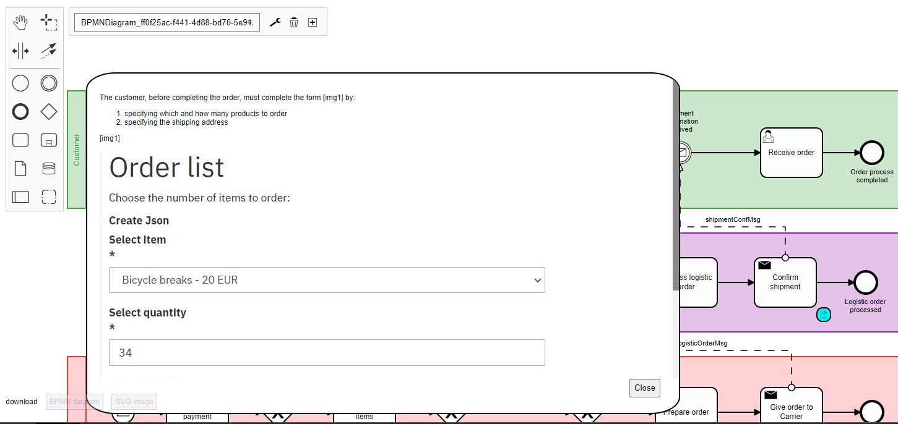

# bpmn-js-documentation-viewer

An extension for [bpmn-js](https://github.com/bpmn-io/bpmn-js) that allows you to show the element documentation on a BPMN 2.0 diagram in a small popup window in the canvas.

This module is meant to work combined to our [wysiwyg documentation plugin](https://github.com/sharedchains/camunda-wysiwyg-documentation), since it uses our specific xml attribute (documentation:extendedDocumentation). 



## Installation

Add as additional module to [bpmn-js](https://github.com/bpmn-io/bpmn-js).

## Example

Install dependencies.

```bash
npm install
```

Run example.

```bash
npm start
```

Check out `localhost:8080`.

## License

MIT